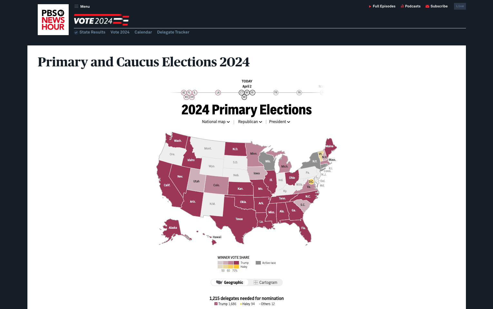
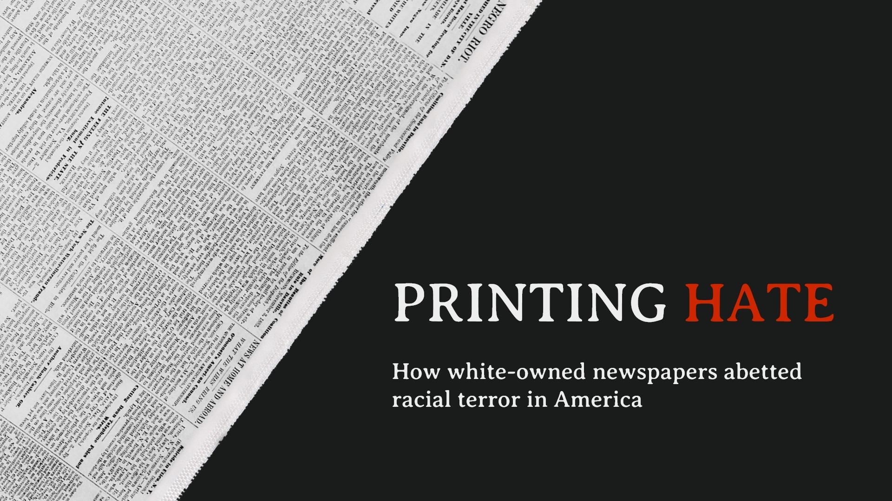

# Jenna Cohen - Work Samples

<a href="https://www.pbs.org/newshour/elections-2024/primaries"><kbd></kbd></a>

### [2024 Primary and Caucus Elections](https://www.pbs.org/newshour/elections-2024/primaries)

Ahead of the already contentious presidential election in November, I worked with NewsHour engineers to prototype and design a hub for coverage about this year's primaries and caucuses.

**My role:**

- Wireframing and Prototyping: Figma
- Interface design and development: Figma, Illustrator
- Information Architecture
- Mobile & Desktop Design
- Sketching & Illustration
- Layout
- Strategic Product Thinking

<a href="https://lynching.cnsmaryland.org/"><kbd></kbd></a>

### [Printing Hate Investigation](https://lynching.cnsmaryland.org/)

Printing Hate is an investigation into how white-owned newspapers have aided and abetted lynchings since 1865. My team and I developed the site with the intention of telling the story the moment a user lands on the page. Our design includes several story page layouts and an interactive database.

**My role:**

- Branding development: Photoshop, Illustrator
- Prototyping: Figma, XD
- Interface design and development: HTML, CSS, GitHub, WordPress
- Animation and video editing: After Effects, Premiere
- Mobile & Desktop Design
- Sketching & Illustration
- Layout
- User Centered Design

<a href="https://www.pbs.org/newshour/features/smart-shopping-quiz/"><kbd></kbd></a>

### [Quiz: Are You A Smart Shopper?](https://www.pbs.org/newshour/features/smart-shopping-quiz/)

As food prices have risen due to factors such as inflation, I worked with members of the NewsHour digital and product team to design [desktop](https://www.figma.com/proto/YmvmeWg0NScrOaoy3c8n3G/Smart-shopping?type=design&node-id=261-3230&t=GKXNvlmaGNoJDwKU-0&scaling=min-zoom&starting-point-node-id=261%3A3230&show-proto-sidebar=1) and [mobile](https://www.figma.com/proto/YmvmeWg0NScrOaoy3c8n3G/Smart-shopping?type=design&node-id=1262-45166&t=GKXNvlmaGNoJDwKU-0&scaling=min-zoom&starting-point-node-id=1262%3A45166&show-proto-sidebar=1) UI prototypes for an interactive feature where users could watch and read to learn how to best shop on a budget, then take our quiz to test their skills. The interactive led our site for engagement time on a single page during the week following publication. It was also featured on our [broadcast program](https://www.youtube.com/watch?v=emErLPu0-O0&t=12s).

**My role:**

- Wireframing and Prototyping: Figma
- Interface design and development: Figma, Illustrator, HTML, CSS, JavaSCript
- User flows
- Mobile & Desktop Design
- Sketching & Illustration
- Layout
- Typography
- Color Theory
